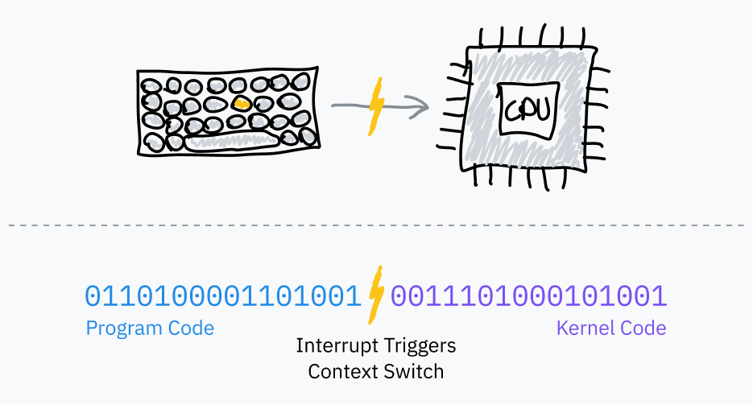
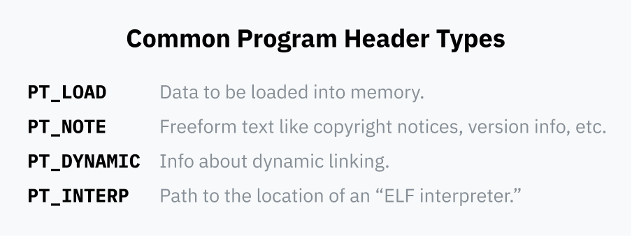

<h1 align='center'>Putting the "You" in CPU</h1>
<p align='center'>by <a href='https://github.com/kognise'>@kognise</a>, with support by <a href='https://github.com/hackclub/hackclub#readme'>Hack Club</a></p>
<p align='center'>Have a thought or suggestion? Create an issue or pull request to this repository!</p>
<p align='center'><a href='https://kognise.dev/writing/putting-the-you-in-cpu'>Read my web edition</a> for nicer code blocks, good typography, and a table of contents.</p>
<br>
<!-- begin article (do not remove) -->

I've done [a lot of things with computers](https://github.com/kognise), but I've always had a gap in my knowledge: what exactly happens when you run a program on your computer? The other day I thought about this gap — I felt like I had most of the requisite low-level knowledge, but I was struggling to piece everything together. Are programs executing through the OS? Directly on the CPU? Something else? I've used syscalls, but how do they *work*? What are they, really? How do multiple programs run at once?

I finally cracked and decided to go all-in on figuring out as much as possible. It turns out that there aren't really any comprehensive resources on this unless you take a systems course in college, *so I had to find information across tons of different sources of varying quality and sometimes conflicting information!* A couple weeks of research and almost 40 pages of notes later, I think I have a much better idea of how computers work from startup to program execution. I would've killed for one solid article explaining what I learned, so I'm writing the article that I wished I had.

And you know what they say... you only truly understand something if you can explain it to someone else.

> Feel like you know this stuff already? Read [part 3](#part-3-how-to-run-a-program) and I *guarantee* you will learn at least one new interesting technical detail. Unless you're like, Linus Torvalds, or a kernel developer who's worked heavily on exec syscalls.

## Part 1: The "Basics"

The one thing that surprised me over and over again while writing this article was how *simple* computers are. It's still hard for me not to psych myself out, expecting more complexity or abstraction than actually exists! If there's one thing you should burn into your brain before continuing, it's that everything that seems simple actually is that simple. This simplicity is very beautiful and sometimes very, very cursed.

Let's start with the basics of how your computer works at its very core.

### How Computers Are Architected

The *central processing unit* (CPU) of a computer is in charge of all computation. It's the big cheese. The shazam alakablam. It starts chugging as soon as you start your computer, executing instruction after instruction after instruction.

The first mass-produced CPU was the [Intel 4004](http://www.intel4004.com/), designed in the late 60s by an Italian physicist and engineer named Federico Faggin. It was a 4-bit architecture instead of the [64-bit](https://en.wikipedia.org/wiki/64-bit_computing) systems we use today, and it was far less complex than modern processors, but a lot of its simplicity does still remain.

The "instructions" that CPUs execute are just binary data: a byte or two to represent what instruction is being run (the opcode), followed by whatever data is needed to run the instruction. What we call *machine code* is nothing but a series of these binary instructions in a row. [Assembly](https://en.wikipedia.org/wiki/Assembly_language) is a helpful syntax for reading and writing machine code that's easier for humans to read and write than raw bits; it is always compiled down to the binary that your CPU knows how to read.


> An aside: instructions aren't always represented 1:1 in machine code like the above example. For example, `add eax, 512` translates to `05 00 02 00 00`.
> 
> The first byte (`05`) is an opcode specifically representing *adding the EAX register to a 16-bit number*. The remaining bytes are 512 (`0x200`) in [little-endian](https://en.wikipedia.org/wiki/Endianness) byte order.
>
> Defuse Security created [a helpful tool](https://defuse.ca/online-x86-assembler.htm) for playing around with the translation between assembly and machine code.

RAM is your computer's main memory bank, a large multi-purpose space which stores all the data used by programs running on your computer. That includes the program code itself, and the code at the core of the operating system. The CPU always reads machine code directly from RAM, and code can't be run if it isn't loaded into RAM.

The CPU stores an *instruction pointer* which points to the location in RAM where it's going to fetch the next instruction. After executing each instruction, the CPU moves the pointer and repeats. This is the *fetch-execute cycle*.

<p align='center'>
	
</p>

After executing an instruction, the pointer moves forward to immediately after the instruction in RAM so that it now points to the next instruction. That's why code runs! The instruction pointer just keeps chugging forward, executing machine code in the order in which it's in memory. Some instructions can tell the instruction pointer to jump somewhere else instead, or jump different places depending on a certain condition; this makes reusable code and conditional logic possible.

This instruction pointer is stored in a [*register*](https://en.wikipedia.org/wiki/Processor_register). Registers are small storage buckets that are extremely fast for the CPU to read and write to. Each CPU architecture has a fixed set of registers, used for everything from storing temporary values during computations to configuring the processor.

Some registers are directly accessible from machine code, like `ebx` in the earlier diagram.

Other registers are only used internally by the CPU, but can often be updated or read using specialized instructions. One example is the instruction pointer, which can't be read directly but can be updated with, for example, a jump instruction.

### Processors Are Naive

Let's go back to the original question: what happens when you run an executable program on your computer? First, a bunch of magic happens to get ready to run it — we’ll work through all of this later — but at the end of the process there’s machine code in a file somewhere. The operating system loads this into RAM and instructs the CPU to jump the instruction pointer to that position in RAM. The CPU continues running its fetch-execute cycle as usual, so the program begins executing!

(This was one of those psyching-myself-out moments for me — seriously, this is how the program you are using to read this article is running. Your CPU is fetching your browser's instructions from RAM in sequence and directly executing them, and they're rendering this article.)


It turns out CPUs have a super basic worldview; they only see the current instruction pointer and a bit of internal state. Processes are entirely operating system abstractions, not something CPUs natively understand or keep track of.

*\*waves hands\* processes are abstractions made up by ~~os devs~~ big byte to sell more computers*

For me, this raises more questions than it answers:

1. If the CPU doesn’t know about multiprocessing and just executes instructions sequentially, why doesn’t it get stuck inside whatever program it’s running? How can multiple programs run at once?
2. If programs run directly on the CPU, and the CPU can directly access RAM, why can't code access memory from other processes, or, god forbid, the kernel?
3. Speaking of which, what's the mechanism that prevents every process from running any instruction and doing anything to your computer? AND WHAT'S A DAMN SYSCALL?

The section question about memory deserves its own section and is covered in part 5 — the TL;DR is that most memory accesses actually go through a layer of misdirection that remaps the entire address space. For now, we're going to pretend that programs can access all RAM directly and computers can only run one process at once. We'll explain away both of these assumptions in time.

It's time to leap through our first rabbit hole into a land filled with syscalls and security rings.

> **Aside: what is a kernel, btw?**
> 
> Your computer's operating system, like macOS, Windows, or Linux, is the collection of software that runs on your computer and makes all the basic stuff work. "Basic stuff" is a really general term, and so is "operating system" — depending on who you ask, it can include such things as the apps, fonts, and icons that come with your computer by default.
> 
> The kernel, however, is the core of the operating system. When you boot up your computer, the instruction pointer starts at a program somewhere. That program is the kernel. The kernel has near-full access to your computer's memory, peripherals, and other resources, and is in charge of running software installed on your computer (known as userland programs). We'll learn about how the kernel has this access — and how userland programs don't — over the course of this article.
>
> Linux is just a kernel and needs plenty of userland software like shells and display servers to be usable. The kernel in macOS is called [XNU](https://en.wikipedia.org/wiki/XNU) and is Unix-like, and the modern Windows kernel is called the [NT Kernel](https://en.wikipedia.org/wiki/Architecture_of_Windows_NT).

### Two Rings to Rule Them All

The *mode* (sometimes called privilege level or ring) a processor is in controls what it's allowed to do. Modern architectures have at least two options: kernel/supervisor mode and user mode. While an architecture might support more than two modes, only kernel mode and user mode are commonly used these days.

In kernel mode, anything goes: the CPU is allowed to execute any supported instruction and access any memory. In user mode, only a subset of instructions is allowed, I/O and memory access is limited, and many CPU settings are locked. Generally, operating systems and drivers run in kernel mode while applications run in user mode.

Processors start in kernel mode. Before executing a program, the kernel initiates the switch to user mode.

<p align='center'>
	
</p>

An example of how processor modes manifest in a real architecture: on x86-64, the current privilege level (CPL) can be read from a register called `cs` (code segment). Specifically, the CPL is contained in the two [least significant bits](https://en.wikipedia.org/wiki/Bit_numbering) of the `cs` register. Those two bits can store x86-64's four possible rings: ring 0 is kernel mode and ring 3 is user mode. Rings 1 and 2 are designed for running drivers but are only used by a handful of older niche operating systems. If the CPL bits are `11`, for example, the CPU is running in ring 3: kernel mode.
 
### What Even is a Syscall?

Programs run in user mode because they can't be trusted with full access to the computer. User mode does its job and prevents access to most of the computer. But programs *somehow* need to be able to access I/O, allocate memory, and interact with the operating system! To do so, software running in user mode has to ask the operating system kernel for help. The OS can then implement its own security protections to prevent programs from doing anything malicious.

If you've ever written code that interacts with the OS, you'll probably recognize functions like `open`, `read`, `fork`, and `exit`. Below a couple of layers of abstraction, these all use *system calls* to ask the OS for help. A system call is a special procedure that lets a program start a transition from user space to kernel space, jumping from the program's code into OS code.

User space to kernel space control transfers are accomplished using a processor feature called [*software interrupts*](https://en.wikipedia.org/wiki/Interrupt#Software_interrupts):

1. During the boot process, the operating system stores a table called an [*interrupt vector table*](https://en.wikipedia.org/wiki/Interrupt_vector_table) (IVT; x86-64 calls this the [interrupt descriptor table](https://en.wikipedia.org/wiki/Interrupt_descriptor_table)) in RAM and registers it with the CPU. The IVT maps interrupt numbers to handler code pointers.

  <p align='center'></p>

2. Then, userland programs can use an instruction like [INT](https://www.felixcloutier.com/x86/intn:into:int3:int1) which tells the processor to look up the given interrupt number in the IVT, switch to kernel mode, and then jump the instruction pointer to the memory address stored in the IVT.

When this kernel code finishes, it tells the CPU to switch back to user mode and return the instruction pointer to where it was when the interrupt was triggered. This is accomplished using an instruction like [IRET](https://www.felixcloutier.com/x86/iret:iretd:iretq).

(If you were curious, the interrupt id used for system calls on Linux is `0x80`. You can read a list of Linux system calls on [Michael Kerrisk's online manpage directory](https://man7.org/linux/man-pages/man2/syscalls.2.html).)

#### Wrapper APIs: Abstracting Away Interrupts

Here's what we know so far about system calls:

- User mode programs can't access I/O or memory directly. They have to ask the OS for help interacting with the outside world.
- Programs can delegate control to the OS with special machine code instructions like INT and IRET.
- Programs can't directly switch privilege levels; hardware interrupts are safe because the processor has been preconfigured *by the OS* with where in the OS code to jump to. The interrupt vector table can only be configured from kernel mode.

Programs need to pass data to the operating system when triggering a syscall; the OS needs to know which specific system call to execute alongside any data the syscall itself needs, for example, what filename to open. The mechanism for passing this data varies by operating system and architecture, but it's usually done by placing data in certain registers or on the stack before triggering the interrupt.

The variance in how system calls are called across devices means it would be wildly impractical for programmers to implement system calls themselves for every program. This would also mean operating systems couldn't change their interrupt handling for fear of breaking every program that was written to use the old system. Finally, we typically don't write programs in raw assembly anymore... programmers can't be expected to drop down to assembly any time they want to read a file or allocate memory.

<p align='center'>
	
</p>

So, operating systems provide an abstraction layer on top of these interrupts. Reusable higher-level library functions that wrap the necessary assembly instructions are provided by [libc](https://www.gnu.org/software/libc/) on Unix-like systems and part of a library called [ntdll.dll](https://learn.microsoft.com/en-us/windows-hardware/drivers/kernel/libraries-and-headers) on Windows. Calls to these library functions themselves don't cause switches to kernel mode, they're just standard function calls. Inside the libraries, assembly code does actually transfer control to the kernel, and is a lot more platform-dependent than the wrapping library subroutine.

When you call `exit(1)` from C running on a Unix-like system, that function is internally running machine code to trigger an interrupt, after placing the system call's opcode and arguments in the right registers/stack/whatever. Computers are so cool!

### The Need for Speed / Let's Get CISC-y

Many [CISC](https://en.wikipedia.org/wiki/Complex_instruction_set_computer) architectures like x86-64 contain instructions designed for system calls, created due to the prevalence of the system call paradigm.

Intel and AMD managed not to coordinate very well on x86-64; it actually has *two* sets of optimized system call instructions. [SYSCALL](https://www.felixcloutier.com/x86/syscall.html) and [SYSENTER](https://www.felixcloutier.com/x86/sysenter) are optimized alternatives to instructions like `INT 0x80`. Their corresponding return instructions, [SYSRET](https://www.felixcloutier.com/x86/sysret.html) and [SYSEXIT](https://www.felixcloutier.com/x86/sysexit), are designed to quickly transition back to user space and resume program code.

(AMD and Intel processors have slightly different compatibility with these instructions. `SYSCALL` is generally the best option for 64-bit programs, while `SYSENTER` has better support with 32-bit programs.)

Representative of the style, [RISC](https://en.wikipedia.org/wiki/Reduced_instruction_set_computer) architectures tend not to have such special instructions. AArch64, the RISC architecture Apple Silicon is based on, uses only [one interrupt instruction](https://developer.arm.com/documentation/ddi0596/2021-12/Base-Instructions/SVC--Supervisor-Call-) for syscalls and software interrupts alike. I think Mac users are doing fine&nbsp;:)

---

Whew, that was a lot! Let's do a brief recap:

- Processors execute instructions in an infinite fetch-execute loop and don't have any concept of operating systems or programs. The mode the processor is in, usually stored in a register, determines what instructions may be executed. Operating system code runs in kernel mode and switches to user mode to run programs.
- To run a binary, the operating system switches to user mode and points the processor to the code's entry point in RAM. Because they only have the privileges of user mode, programs that want to interact with the world need to jump to OS code for help. System calls are a standardized way for programs to switch from user mode to kernel mode and into OS code.
- Programs typically use these syscalls by calling shared library functions. These wrap machine code for either software interrupts or architecture-specific syscall instructions that transfer control to the OS kernel and switch rings. The kernel does its business and switches back to user mode and returns to the program code.

Let’s figure out how to answer my first question from earlier

> If the CPU doesn't keep track of more than one process and just executes instruction after instruction, why doesn't it get stuck inside whatever program it's running? How can multiple programs run at once?

The answer to this, my dear friend, is also the answer to why Coldplay is so popular... clocks! (Well, technically timers. I just wanted to shoehorn that joke in.)

## Part 2: Slice Dat Time

Let's say you're building an operating system and you want users to be able to run multiple programs at once. You don’t have a fancy multi-core processor though, so your CPU can only run one instruction at a time!

Luckily, you’re a very smart OS developer. You figure out that you can fake concurrency by letting processes take turns on the CPU. If you cycle through the processes and run a couple instructions from each one, they can all be responsive without any single process hogging the CPU.

How do you take control back from program code? After a bit of research, you discover that most computers come with timer chips. You can program a timer chip to trigger a switch to an OS interrupt handler after a certain amount of time passes.

### **Hardware Interrupts**

Earlier, we talked about how software interrupts are used to hand control from a userland program to the OS. These are called “software” interrupts because they’re voluntarily triggered by a program — machine code executed by the processor in the normal fetch-execute cycle tells it to switch control to the kernel.

<p align='center'>
	
</p>

OS schedulers use *timer chips* like [PITs](https://en.wikipedia.org/wiki/Programmable_interval_timer) to trigger hardware interrupts for multitasking:

1. Before jumping to program code, the OS sets the timer chip to trigger an interrupt after some period of time.
2. The OS switches to user mode and jumps to the next instruction of the program.
3. When the timer elapses, it triggers a hardware interrupt to switch to kernel mode and jump to OS code.
4. The OS can now save where the program left off, load a different program, and repeat the process.

This is called *preemptive multitasking*; the interruption of a process is called [*preemption*](https://en.wikipedia.org/wiki/Preemption_(computing)). If you’re, say, reading this article on a browser and also listening to music, your very own computer is probably following this exact cycle thousands of times a second.

### Timeslice Calculation

A *timeslice* is the duration an OS scheduler allows a process to run before preempting it. The simplest way to pick timeslices is to give every process the same timeslice, perhaps in the 10&nbsp;ms range, and cycle through tasks in order. This is called *fixed timeslice round-robin* scheduling.

> **Aside: fun jargon facts!**
> 
> Did you know that timeslices are often called "quantums?" Now you do, and you can impress all your tech friends. I think I deserve heaps of praise for not saying quantum in every other sentence in this article.
> 
> Speaking of timeslice jargon, Linux kernel devs use the [jiffy](https://github.com/torvalds/linux/blob/22b8cc3e78f5448b4c5df00303817a9137cd663f/include/linux/jiffies.h) time unit to count fixed frequency timer ticks. Among other things, jiffies are used for measuring the lengths of timeslices. Linux's jiffy frequency is typically 1000 Hz but can be configured at compile time.

A slight improvement to fixed timeslice scheduling is to pick a *target latency* — the ideal longest time for a process to respond. The target latency should be equal to the time it takes for a process to resume execution after being preempted. Timeslices are calculated by dividing the target latency by the total number of tasks; this is better than fixed timeslice scheduling because it eliminates wasteful task switching with fewer processes. With a target latency of 15&nbsp;ms and 10 processes, each process would get 15/10 or 1.5&nbsp;ms to run. With only 3 processes, each process gets a longer 5&nbsp;ms timeslice while still hitting the target latency.

Process switching is computationally expensive because it requires saving the entire state of the current program and restoring a different one. Past a certain threshold, too small a calculated timeslice can result in worse performance than having a longer fixed timeslice. It's common to have a fixed timeslice that serves as a lower bound when there are many processes. At the time of writing this article, Linux's scheduler uses a target latency of 6&nbsp;ms and a minimum granularity of 0.75&nbsp;ms.

<p align='center'>
	
</p>

Round-robin scheduling with this basic timeslice calculation is close to what most computers do nowadays. It's still a bit naive; most operating systems tend to have more complex schedulers which take process priorities and deadlines into account. Since 2007, Linux has used a scheduler called [Completely Fair Scheduler](https://docs.kernel.org/scheduler/sched-design-CFS.html). CFS does a bunch of very fancy computer science things to prioritize tasks and divvy up CPU time.

Every time the OS preempts a process it needs to load the new program's saved execution context, including its memory environment. This is accomplished by telling the CPU to use a different *page table*, the mapping from "virtual" to physical addresses. This is also the system that prevents programs from accessing each other's memory; we'll go down this rabbit hole in parts 5 and 6 of this article.

### Note #1: Kernel Preemptability

So far, we've been only talking about the preemption and scheduling of userland processes. Kernel code might make programs feel laggy if it took too long handling a syscall or executing driver code.

Modern kernels, including Linux, are [preemptive kernels](https://en.wikipedia.org/wiki/Kernel_preemption). This means they're programmed in a way that allows kernel code itself to be interrupted and scheduled just like userland processes.

This isn't very important to know about unless you're writing a kernel or something, but basically every article I've read has mentioned it so I thought I would too! Extra knowledge is rarely a bad thing.

### Note #2: A History Lesson

Ancient operating systems, including classic Mac OS and versions of Windows long before NT, used a predecessor to preemptive multitasking. Rather than the OS deciding when to preempt programs, the programs themselves would choose to yield to the OS. They would trigger a software interrupt to say, "hey, you can let another program run now." These explicit yields were the only way for the OS to regain control and switch to the next scheduled process.

This is called [*cooperative multitasking*](https://en.wikipedia.org/wiki/Cooperative_multitasking). It has a couple major flaws: malicious or just poorly designed programs can easily freeze the entire operating system, and it's nigh impossible to ensure temporal consistency for realtime/time-sensitive tasks. For these reasons, the tech world switched to preemptive multitasking a long time ago and never looked back.

## Part 3: How to Run a Program

So far, we've covered how CPUs execute machine code loaded from executables, what ring-based security is, and how syscalls work. In this section, we'll dive deep into the Linux kernel to figure out how programs are loaded and run in the first place.

We're specifically going to look at Linux on x86-64. Why?

- Linux is a fully featured production OS for desktop, mobile, and server use cases. Linux is open source, so it's super easy to research just by reading its source code. I will be directly referencing some kernel code in this article!
- x86-64 is the architecture that most modern desktop computers use, and the target architecture of a lot of code. The subset of behavior I mention that is x86-64-specific will generalize well.

Most of what we learn will generalize very well to other operating systems and architectures, even if they differ in various specific ways.

### Basic Behavior of Exec Syscalls

<p align='center'>
	
</p>

Let's start with a very important system call: `execve`. It loads a program and, if successful, replaces the current process with that program. A couple other syscalls (`execlp`, `execvpe`, etc.) exist, but they all layer on top of `execve` in various fashions.

> **Aside: `execveat`**
> 
> `execve` is *actually* built on top of `execveat`, a more general syscall that runs a program with some configuration options. For simplicity, we'll mostly talk about `execve`; the only difference is that it provides some defaults to `execveat`.
>
> Curious what `ve` stands for? The `v` means one parameter is the vector (list) of arguments (`argv`), and the `e` means another parameter is the vector of environment variables (`envp`). Various other exec syscalls have different suffices to designate different call signatures. The `at` in `execveat` is just "at", because it specifies the location to run `execve` at.

The call signature of `execve` is:

```c
int execve(const char *filename, char *const argv[], char *const envp[]);
```

- The `filename` argument specifies a path to the program to run.
- `argv` is a null-terminated (meaning the last item is a null pointer) list of arguments to the program. The `argc` argument you'll commonly see passed to C main functions is actually calculated later by the syscall, thus the null-termination.
- The `envp` argument contains another null-terminated list of environment variables used as context for the application. They're... conventionally `KEY=VALUE` pairs. *Conventionally.* I love computers.

Fun fact! You know that convention where a program's first argument is the name of the program? That's *purely a convention*, and isn't actually set by the `execve` syscall itself! The first argument will be whatever is passed to `execve` as the first item in the `argv` argument, even if it has nothing to do with the program name.

Interestingly, `execve` does have some code that assumes `argv[0]` is the program name. More on this later when we talk about interpreted scripting languages.

#### Step 0: Definition

We already know how syscalls work, but we've never seen a real-world code example! Let's look at the Linux kernel's source code to see how `execve` is defined under the hood:

[fs/exec.c](https://github.com/torvalds/linux/blob/22b8cc3e78f5448b4c5df00303817a9137cd663f/fs/exec.c#L2105-L2111):

```c
SYSCALL_DEFINE3(execve,
		const char __user *, filename,
		const char __user *const __user *, argv,
		const char __user *const __user *, envp)
{
	return do_execve(getname(filename), argv, envp);
}
```

`SYSCALL_DEFINE3` is a macro for defining a 3-argument system call's code.

> I was curious why the [arity](https://en.wikipedia.org/wiki/Arity) is hardcoded in the macro name; I googled around and learned that this was a workaround to fix [some security vulnerability](https://nvd.nist.gov/vuln/detail/CVE-2009-0029).

The filename argument is passed to a `getname()` function, which copies the string from user space to kernel space and does some usage tracking things. It returns a `filename` struct, which is defined in `include/linux/fs.h`. It stores a pointer to the original string in user space as well as a new pointer to the value copied to kernel space:

[include/linux/fs.h](https://github.com/torvalds/linux/blob/22b8cc3e78f5448b4c5df00303817a9137cd663f/include/linux/fs.h#L2294-L2300):

```c
struct filename {
	const char		*name;	/* pointer to actual string */
	const __user char	*uptr;	/* original userland pointer */
	int			refcnt;
	struct audit_names	*aname;
	const char		iname[];
};
```

The `execve` system call then calls a `do_execve()` function. This, in turn, calls `do_execveat_common()`with some defaults. The `execveat` syscall which I mentioned earlier also calls `do_execveat_common()`, but passes through more user-provided options.

In the below snippet, I've included the definitions of both `do_execve` and `do_execveat`:

[fs/exec.c](https://github.com/torvalds/linux/blob/22b8cc3e78f5448b4c5df00303817a9137cd663f/fs/exec.c#L2028-L2046):

```c
static int do_execve(struct filename *filename,
	const char __user *const __user *__argv,
	const char __user *const __user *__envp)
{
	struct user_arg_ptr argv = { .ptr.native = __argv };
	struct user_arg_ptr envp = { .ptr.native = __envp };
	return do_execveat_common(AT_FDCWD, filename, argv, envp, 0);
}

static int do_execveat(int fd, struct filename *filename,
		const char __user *const __user *__argv,
		const char __user *const __user *__envp,
		int flags)
{
	struct user_arg_ptr argv = { .ptr.native = __argv };
	struct user_arg_ptr envp = { .ptr.native = __envp };

	return do_execveat_common(fd, filename, argv, envp, flags);
}
```

\[spacing sic\]

In `execveat`, a file descriptor (a type of id that points to *some resource*) is passed to the syscall and then to `do_execveat_common`. This specifies the directory to execute the program relative to.

In `execve`, a special value is used for the file descriptor argument, `AT_FDCWD`. This is a shared constant in the Linux kernel that tells functions to interpret pathnames as relative to the current working directory. Functions that accept file descriptors usually include a manual check like <code>if&nbsp;(fd&nbsp;==&nbsp;AT_FDCWD) \{&nbsp;/\*&nbsp;special codepath&nbsp;\*/&nbsp;\}</code>.

#### Step 1: Setup

We've now reached `do_execveat_common`, the core function handling program execution. We're going to take a small step back from staring at code to get a more general idea of what's going on.

The first major job of `do_execveat_common` is setting up a struct called `linux_binprm`. I won't include a copy of [the whole struct definition](https://github.com/torvalds/linux/blob/22b8cc3e78f5448b4c5df00303817a9137cd663f/include/linux/binfmts.h#L15-L65), but there are a couple of important fields to go over:

- Data structures like `mm_struct` and `vm_area_struct` are defined to prepare virtual memory management for the new program.
- `argc` and `envc` are calculated and stored to be passed to the program.
- `filename` and `interp` store the filename of the program and its interpreter, respectively. These start out equal to each other, but can change in some cases: one situation in which the binary being *executed* is different from the program name is when running interpreted programs like Python scripts with a [shebang](https://en.wikipedia.org/wiki/Shebang_(Unix)). In this example, `filename` points to the Python file but the `interp` is the Python interpreter's path.
- `buf` is an array filled with the first 256 bytes of the file to be executed. It's used to detect the format of the file and load script shebangs.

(TIL: binprm stands for **bin**ary **pr**og**r**a**m**.)

Let's take a closer look at this buffer `buf`:

[linux_binprm @ include/linux/binfmts.h](https://github.com/torvalds/linux/blob/22b8cc3e78f5448b4c5df00303817a9137cd663f/include/linux/binfmts.h#L64):

```c
	char buf[BINPRM_BUF_SIZE];
```

As we can see, its length is defined as the constant `BINPRM_BUF_SIZE`. By searching the codebase for this string, we can find a definition for this in `include/uapi/linux/binfmts.h`:

[include/uapi/linux/binfmts.h](https://github.com/torvalds/linux/blob/22b8cc3e78f5448b4c5df00303817a9137cd663f/include/uapi/linux/binfmts.h#L18-L19):

```c
/* sizeof(linux_binprm->buf) */
#define BINPRM_BUF_SIZE 256
```

So, the kernel loads the opening 256 bytes of the executed file into this memory buffer.

> **Aside: what's a UAPI?**
> 
> You might notice that the above code's path contains `/uapi/`. Why isn't the length defined in the same file as the `linux_binprm` struct, `include/linux/binfmts.h`?
>
> UAPI stands for "userspace API." In this case, it means someone decided that the length of the buffer should be part of the kernel's public API. In theory, everything UAPI is exposed to userland, and everything non-UAPI is private to kernel code.
>
> Kernel and user space code originally coexisted in one jumbled mass. In 2012, UAPI code was [refactored into a separate directory](https://lwn.net/Articles/507794/) as an attempt to improve maintainability.

#### Step 2: Binfmts

The kernel's next major job is iterating through a bunch of "binfmt" (binary format) handlers. These handlers are defined in files like `fs/binfmt_elf.c` and `fs/binfmt_flat.c`. [Kernel modules](https://wiki.archlinux.org/title/Kernel_module) can also add their own binfmt handlers to the pool.

Each handler exposes a `load_binary()` function which takes a `linux_binprm` struct and checks if the handler understands the program's format.

This often involves looking for [magic numbers](https://en.wikipedia.org/wiki/Magic_number_(programming)) in the buffer, attempting to decode the start of the program (also from the buffer), and/or checking the file extension. If the handler does support the format, it prepares the program for execution and returns a success code. Otherwise, it quits early and returns an error code.

The kernel tries the `load_binary()` function of each binfmt until it reaches one that succeeds. Sometimes these will run recursively; for example, if a script has an interpreter specified and that interpreter is, itself, a script, the hierarchy might be `binfmt_script` > `binfmt_script` > `binfmt_elf` (where ELF is the executable format at the end of the chain).

#### Format Highlight: Scripts

Of the many formats Linux supports, `binfmt_script` is the first I want to specifically talk about.

Have you ever read or written a shebang? That line at the start of some scripts that specifies the path to the interpreter?

<!-- startLine: 1 -->
```bash
#!/bin/bash
```

I always just assumed these were handled by the shell, but no! Shebangs are actually a feature of the kernel, and scripts are executed with the same syscalls as every other program. Computers are *so cool*.

Take a look at how `fs/binfmt_script.c` checks if a file starts with a shebang:

[load_script @ fs/binfmt_script.c](https://github.com/torvalds/linux/blob/22b8cc3e78f5448b4c5df00303817a9137cd663f/fs/binfmt_script.c#L40-L42):

```c
	/* Not ours to exec if we don't start with "#!". */
	if ((bprm->buf[0] != '#') || (bprm->buf[1] != '!'))
		return -ENOEXEC;
```

If the file does start with a shebang, the binfmt handler then reads the interpreter path and any space-separated arguments after the path. It stops when it hits either a newline or the end of the buffer.

There are two interesting, wonky things going on here.

**First of all**, remember that buffer in `linux_binprm` that was filled with the first 256 bytes of the file? That's used for executable format detection, but that same buffer is also what shebangs are read out of in `binfmt_script`.

During my research, I read an article that described the buffer as 128 bytes long. At some point after that article was published, the length was doubled to 256 bytes! Curious why, I checked the Git blame — a log of everybody who edited a certain line of code — for the line where `BINPRM_BUF_SIZE` is defined in the Linux source code. Lo and behold...


COMPUTERS ARE SO COOL!

Since shebangs are handled by the kernel, and pull from `buf` instead of loading the whole file, they're *always* truncated to the length of `buf`. Apparently, 4 years ago, someone got annoyed by the kernel truncating their >128-character paths, and their solution was to double the truncation point by doubling the buffer size! Today, on your very own Linux machine, if you have a shebang line more than 256 characters long, everything past 256 characters will be *completely lost*.


Imagine having a bug because of this. Imagine trying to figure out the root cause of what's breaking your code. Imagine how it would feel, discovering that the problem is deep within the Linux kernel. Woe to the next IT person at a massive enterprise who discovers that part of a path has mysteriously gone missing.

**The second wonky thing:** remember how it's only *convention* for `argv[0]` to be the program name, how the caller can pass any `argv` they want to an exec syscall and it will pass through unmoderated?

It just so happens that `binfmt_script` is one of those places that *assumes* `argv[0]` is the program name. It always removes `argv[0]`, and then adds the following to the start of `argv`:

- Path to the interpreter
- Arguments to the interpreter
- Filename of the script

So if the `argv` passed to the syscall is `[ "A", "B", "C" ]` and the shebang is `#!/usr/bin/node --experimental-module`, the modified `argv` will be `[ "/usr/bin/node", "--experimental-module", "B", "C" ]`.

After updating `argv`, the handler finishes preparing the file for execution by setting `linux_binprm.interp` to the interpreter path (in this case, the Node binary). Finally, it returns 0 to indicate success preparing the program for execution.

#### Format Highlight: Miscellaneous Interpreters

Another interesting handler is `binfmt_misc`. It opens up the ability to add some limited formats through userland configuration, by mounting a special file system at `/proc/sys/fs/binfmt_misc/`. Programs can perform [specially formatted](https://docs.kernel.org/admin-guide/binfmt-misc.html) writes to files in this directory to add their own handlers. Each configuration entry specifies:

- How to detect their file format. This can either specify either a magic number at a certain offset or a file extension to look for.
- The path to an interpreter executable. There's no way to specify interpreter arguments, so a wrapper script is needed if those are desired.
- Some configuration flags, including one specifying how `binfmt_misc` updates `argv`.

This `binfmt_misc` system is often used by Java installations, configured to detect class files by their `0xCAFEBABE` magic bytes and JAR files by their extension. On my particular system, a  handler is configured that detects Python bytecode by its .pyc extension and passes it to the appropriate handler.

This is a pretty cool way to let program installers add support for their own formats without needing to write highly privileged kernel code.

### In the End (Not the Linkin Park Song)

An exec syscall will always end up in one of two paths:

- It will eventually reach an executable binary format that it understands, perhaps after several layers of script interpreters, and run that code. At this point, the old code has been replaced.
- ... or it will exhaust all its options, tail between its legs, and return an error code to the calling program.

If you've ever used a Unix-like system, you might've noticed that shell scripts run from a terminal still execute if they don't have a shebang line or `.sh` extension. You can test this out right now if you have a non-Windows terminal handy:

<!-- name: Shell session -->
```
$ echo "echo hello" > ./file
$ chmod +x ./file
$ ./file
hello
```

(`chmod +x` tells the OS that a file is an executable. You won't be able to run it otherwise.)

So, why does the shell script run as a shell script? The kernel's format handlers should have no clear way of detecting shell scripts without any discernible label!

Well, it turns out that this behavior isn't part of the kernel. It's actually a common way for your *shell* to handle a failure case.

When you execute a file using a shell and the exec syscall fails, most shells will *retry executing the file as a shell script* by executing a shell with the filename as the first argument. Bash will typically use itself as this interpreter, while ZSH uses whatever `sh` is, usually [Bourne shell](https://en.wikipedia.org/wiki/Bourne_shell).

This behavior is so common because it's specified in [*POSIX*](https://en.wikipedia.org/wiki/POSIX), an old standard designed to make code portable between Unix systems. While POSIX isn't strictly followed by most tools or operating systems, many of its conventions are still shared.

> If \[an exec syscall\] fails due to an error equivalent to the `[ENOEXEC]` error, **the shell shall execute a command equivalent to having a shell invoked with the command name as its first operand**, with any remaining arguments passed to the new shell. If the executable file is not a text file, the shell may bypass this command execution. In this case, it shall write an error message and shall return an exit status of 126.
> 
> *Source: <cite>[Shell Command Language, POSIX.1-2017](https://pubs.opengroup.org/onlinepubs/9699919799.2018edition/utilities/V3_chap02.html#tag_18_09_01_01)</cite>*

Computers are so cool!

## Part 4: Becoming an Elf-Lord

We pretty thoroughly understand `execve` now. At the end of most paths, the kernel will reach a final program containing machine code for it to launch. Typically, a setup process is required before actually jumping to the code — for example, different parts of the program have to be loaded into the right places in memory. Each program needs different amounts of memory for different things, so we have standard file formats that specify how to set up a program for execution. While Linux supports many such formats, the most common format by far is *ELF* (executable and linkable format).

<p>
	<p align='center'>
		
	</p>
</p>
<div align='center'>
	<p style='margin-top: -10px;'>
		(Thank you to <a href='https://ncase.me/' target='_blank'>Nicky Case</a> for the adorable drawing.)
	</p>
</div>

> **Aside: are elves everywhere?**
> 
> When you run an app or command-line program on Linux, it's exceedingly likely that it's an ELF binary. However, on macOS the de-facto format is  [Mach-O](https://en.wikipedia.org/wiki/Mach-O) instead. Mach-O does all the same things as ELF but is structured differently. On Windows, .exe files use the [Portable Executable](https://en.wikipedia.org/wiki/Portable_Executable) format which is, again, a different format with the same concept.

In the Linux kernel, ELF binaries are handled by the `binfmt_elf` handler, which is more complex than many other handlers and contains thousands of lines of code. It's responsible for parsing out certain details from the ELF file and using them to load the process into memory and execute it.

*I ran some command-line kung fu to sort binfmt handlers by line count:*

<!-- name: Shell session -->
```
$ wc -l binfmt_* | sort -nr | sed 1d
    2181 binfmt_elf.c
    1658 binfmt_elf_fdpic.c
     944 binfmt_flat.c
     836 binfmt_misc.c
     158 binfmt_script.c
      64 binfmt_elf_test.c
```

### File Structure

Before looking more deeply at how `binfmt_elf` executes ELF files, let's take a look at the file format itself. ELF files are typically made up of four parts:

<p align='center'>
	
</p>

#### ELF Header

Every ELF file has an [ELF header](https://refspecs.linuxfoundation.org/elf/gabi4+/ch4.eheader.html). It has the very important job of conveying basic information about the binary such as:

- What processor it's designed to run on. ELF files can contain machine code for different processor types, like ARM and x86.
- Whether the binary is meant to be run on its own as an executable, or whether it's meant to be loaded by other programs as a "dynamically linked library." We'll go into details about what dynamic linking is soon.
- The entry point of the executable. Later sections specify exactly where to load data contained in the ELF file into memory. The entry point is a memory address pointing to where the first machine code instruction is in memory after the entire process has been loaded.

The ELF header is always at the start of the file. It specifies the locations of the program header table and section header, which can be anywhere within the file. Those tables, in turn, point to data stored elsewhere in the file.

#### Program Header Table

The [program header table](https://refspecs.linuxbase.org/elf/gabi4+/ch5.pheader.html) is a series of entries containing specific details for how to load and execute the binary at runtime. Each entry has a type field that says what detail it's specifying — for example, `PT_LOAD` means it contains data that should be loaded into memory, but `PT_NOTE` means the segment contains informational text that shouldn't necessarily be loaded anywhere.

<p align='center'>
	
</p>

Each entry specifies information about where its data is in the file and, sometimes, how to load the data into memory:

- It points to the position of its data within the ELF file.
- It can specify what virtual memory address the data should be loaded into memory at. This is typically left blank if the segment isn't meant to be loaded into memory.
- Two fields specify the length of the data: one for the length of the data in the file, and one for the length of the memory region to be created. If the memory region length is longer than the length in the file, the extra memory will be filled with zeroes. This is beneficial for programs that might want a static segment of memory to use at runtime; these empty segments of memory are typically called [BSS](https://en.wikipedia.org/wiki/.bss) segments.
- Finally, a flags field specifies what operations should be permitted if it's loaded into memory: `PF_R` makes it readable, `PF_W` makes it writable, and `PF_X` means it's code that should be allowed to execute on the CPU.

#### Section Header Table

The [section header table](https://refspecs.linuxbase.org/elf/gabi4+/ch4.sheader.html) is a series of entries containing information about *sections*. This section information is like a map, charting the data inside the ELF file. It makes it easy for [programs like debuggers](https://www.sourceware.org/gdb/) to understand the intended uses of different portions of the data.

<p align='center'>
	
</p>

For example, the program header table can specify a large swath of data to be loaded into memory together. That single `PT_LOAD` block might contain both code and global variables! There's no reason those have to be specified separately to *run* the program; the CPU just starts at the entry point and steps forward, accessing data when and where the program requests it. However, software like a debugger for *analyzing* the program needs to know exactly where each area starts and ends, otherwise it might try to decode some text that says "hello" as code (and since that isn't valid code, explode). This information is stored in the section header table.

While it's usually included, the section header table is actually optional. ELF files can run perfectly well with the section header table completely removed, and developers who want to hide what their code does will sometimes intentionally strip or mangle the section header table from their ELF binaries to [make them harder to decode](https://binaryresearch.github.io/2019/09/17/Analyzing-ELF-Binaries-with-Malformed-Headers-Part-1-Emulating-Tiny-Programs.html).

Each section has a name, a type, and some flags that specify how it's intended to be used and decoded. Standard names usually start with a dot by convention. The most common sections are:

- `.text`: machine code to be loaded into memory and executed on the CPU. `SHT_PROGBITS` type with the `SHF_EXECINSTR` flag to mark it as executable, and the `SHF_ALLOC` flag which means it's loaded into memory for execution. (Don't get confused by the name, it's still just binary machine code! I always found it somewhat strange that it's called `.text` despite not being readable "text.")
- `.data`: initialized data hardcoded in the executable to be loaded into memory. For example, a global variable containing some text might be in this section. If you write low-level code, this is the section where statics go. This also has the type `SHT_PROGBITS`, which just means the section contains "information for the program." Its flags are `SHF_ALLOC` and `SHF_WRITE` to mark it as writable memory.
- `.bss`: I mentioned earlier that it's common to have some allocated memory that starts out zeroed. It would be a waste to include a bunch of empty bytes in the ELF file, so a special segment type called BSS is used. It's helpful to know about BSS segments during debugging, so there's also a section header table entry that specifies the length of the memory to be allocated. It's of type `SHT_NOBITS`, and is flagged `SHF_ALLOC` and `SHF_WRITE`.
- `.rodata`: this is like `.data` except it's read-only. In a very basic C program that runs `printf("Hello, world!")`, the string "Hello world!" would be in a `.rodata` section, while the actual printing code would be in a `.text` section.
- `.shstrtab`: this is a fun implementation detail! The names of sections themselves (like `.text` and `.shstrtab`) aren't included directly in the section header table. Instead, each entry contains an offset to a location in the ELF file that contains its name. This way, each entry in the section header table can be the same size, making them easier to parse — an offset to the name is a fixed-size number, whereas including the name in the table would use a variable-size string. All of this name data is stored in its own section called `.shstrtab`, of type `SHT_STRTAB`.

#### Data

The program and section header table entries all point to blocks of data within the ELF file, whether to load them into memory, to specify where program code is, or just to name sections. All of these different pieces of data are contained in the data section of the ELF file.


### A Brief Explanation of Linking 

Back to the `binfmt_elf` code: the kernel cares about two types of entries in the program header table.

`PT_LOAD` segments specify where all the program data, like the `.text` and `.data` sections, need to be loaded into memory. The kernel reads these entries from the ELF file to load the data into memory so the program can be executed by the CPU.

The other type of program header table entry that the kernel cares about is `PT_INTERP`, which specifies a "dynamic linking runtime."

Before we talk about what dynamic linking is, let's talk about "linking" in general. Programmers tend to build their programs on top of libraries of reusable code — for example, libc, which we talked about earlier. When turning your source code into an executable binary, a program called a linker resolves all these references by finding the library code and copying it into the binary. This process is called *static linking*, which means external code is included directly in the file that's distributed.

However, some libraries are super common. You'll find libc is used by basically every program under the sun, since it's the canonical interface for interacting with the OS through syscalls. It would be a terrible use of space to include a separate copy of libc in every single program on your computer. Also, it might be nice if bugs in libraries could be fixed in one place rather than having to wait for each program that uses the library to be updated. Dynamic linking is the solution to these problems.

If a statically linked program needs a function `foo` from a library called `bar`, the program would include a copy of the entirety of `foo`. However, if it's dynamically linked it would only include a reference saying "I need `foo` from library `bar`." When the program is run, `bar` is hopefully installed on the computer and the `foo` function's machine code can be loaded into memory on-demand. If the computer's installation of the `bar` library is updated, the new code will be loaded the next time the program runs without needing any change in the program itself.


### Dynamic Linking in the Wild

On Linux, dynamically linkable libraries like `bar` are typically packaged into files with the .so (Shared Object) extension. These .so files are ELF files just like programs — you may recall that the ELF header includes a field to specify whether the file is an executable or a library. In addition, shared objects have a `.dynsym` section in the section header table which contains information on what symbols are exported from the file and can be dynamically linked to.

On Windows, libraries like `bar` are packaged into .dll (**d**ynamic **l**ink **l**ibrary) files. macOS uses the .dylib (**dy**namically linked **lib**rary) extension. Just like macOS apps and Windows .exe files, these are formatted slightly differently from ELF files but are the same concept and technique.

An interesting distinction between the two types of linking is that with static linking, only the portions of the library that are used are included in the executable and thus loaded into memory. With dynamic linking, the *entire library* is loaded into memory. This might initially sound less efficient, but it actually allows modern operating systems to save *more* space by loading a library into memory once and then sharing that code between processes. Only code can be shared as the library needs different state for different programs, but the savings can still be on the order of tens to hundreds of megabytes of RAM.

### Execution

Let's hop on back to the kernel running ELF files: if the binary it's executing is dynamically linked, the OS can't just jump to the binary's code right away because there would be missing code — remember, dynamically linked programs only have references to the library functions they need!

To run the binary, the OS needs to figure out what libraries are needed, load them, replace all the named pointers with actual jump instructions, and *then* start the actual program code. This is very complex code that interacts deeply with the ELF format, so it's usually a standalone program rather than part of the kernel. ELF files specify the path to the program they want to use (typically something like `/lib64/ld-linux-x86-64.so.2`) in a `PT_INTERP` entry in the program header table.

After reading the ELF header and scanning through the program header table, the kernel can set up the memory structure for the new program. It starts by loading all `PT_LOAD` segments into memory, populating the program's static data, BSS space, and machine code. If the program is dynamically linked, the kernel will have to execute the [ELF interpreter](https://unix.stackexchange.com/questions/400621/what-is-lib64-ld-linux-x86-64-so-2-and-why-can-it-be-used-to-execute-file) (`PT_INTERP`), so it also loads the interpreter's data, BSS, and code into memory.

Now the kernel needs to set the instruction pointer for the CPU to restore when returning to userland. If the executable is dynamically linked, the kernel sets the instruction pointer to the start of the ELF interpreter's code in memory. Otherwise, the kernel sets it to the start of the executable.

The kernel is almost ready to return from the syscall (remember, we're still in `execve`). It pushes the `argc`, `argv`, and environment variables to the stack for the program to read when it begins.

The registers are now cleared. Before handling a syscall, the kernel stores the current value of registers to the stack to be restored when switching back to user space. Before returning to user space, the kernel zeroes this part of the stack.

Finally, the syscall is over and the kernel returns to userland. It restores the registers, which are now zeroed, and jumps to the stored instruction pointer. That instruction pointer is now the starting point of the new program (or the ELF interpreter) and the current process has been replaced!

## Part 5: The Translator in Your Computer

Up until now, every time I've talked about reading and writing memory was a little wishy-washy. ELF files specify specific memory addresses to load data into, so why aren't there problems with different processes trying to use conflicting memory? Why does each process seem to have a different memory environment?

Also, how exactly did we get here? We understand that `execve` is a syscall that *replaces* the current process with a new program, but this doesn't explain how multiple processes can be started. It definitely doesn't explain how the very first program runs — what chicken (process) lays (spawns) all the other eggs (other processes)?

We're nearing the end of our journey. After these two questions are answered, we'll have a mostly complete understanding of how your computer got from bootup to running the software you're using right now.

### Memory is Fake

So... about memory. It turns out that when the CPU reads from or writes to a memory address, it's not actually referring to that location in *physical* memory (RAM). Rather, it's pointing to a location in *virtual* memory space.
 
The CPU talks to a chip called a [*memory management unit*](https://en.wikipedia.org/wiki/Memory_management_unit) (MMU). The MMU works like a translator, keeping track of a mapping between locations in virtual memory to the location in RAM which functions like a dictionary. When the CPU is given an instruction to read from memory address `0xAD4DA83F`, it asks the MMU to translate that address. The MMU looks it up in the dictionary, discovers that the matching physical address is `0x70B7BD74`, and sends the number back to the CPU. The CPU can then read from that address in RAM.

<p align='center'>
	
</p>

When the computer first boots up, memory accesses go directly to physical RAM. Immediately after startup, the OS creates the translation dictionary and tells the CPU to start using the MMU.

This dictionary is actually called a *page table*, and this system of translating every memory access is called *paging*. Entries in the page table are called *pages* and each one represents how a certain chunk of virtual memory maps to RAM. These chunks are always a fixed size, and each processor architecture has a different page size. x86-64 has a default 4 KiB page size, meaning each page specifies the mapping for a block of memory 4,096 bytes long. (x86-64 also allows operating systems to enable larger 2 MiB or 4 GiB pages, which can improve address translation speed but increase memory fragmentation and waste.)

The page table itself just resides in RAM. While it can contain millions of entries, each entry's size is only on the order of a couple bytes, so the page table doesn't take up too much space.*

To enable paging at boot, the kernel first constructs the page table in RAM. Then, it stores the physical address of the start of the page table in a register called the page table base register (PTBR). Finally, the kernel enables paging to translate all memory accesses with the MMU. On x86-64, the top 20 bits of control register 3 (CR3) function as the PTBR. Bit 31 of CR0, designated PG for Paging, is set to 1 to enable paging.

The magic of the paging system is that the page table can be edited while the computer is running. This is how each process can have its own isolated memory space — when the OS switches context from one process to another, an important task is remapping the virtual memory space to a different area in physical memory. Let's say you have two processes: process A can have its code and data (likely loaded from an ELF file!) at `0x00200000`, and process B can access its code and data from the very same address. Those two processes can even be the same program, because they aren't actually fighting over that address range! The data for process A is somewhere far from process B in physical memory, and is mapped to `0x00200000` by the kernel when switching to the process.


> **Aside: cursed ELF fact**
>
> In certain situations, `binfmt_elf` has to map the first page of memory to zeroes. Some programs written for UNIX System V Release 4.0 (SVr4), an OS from 1988 that was the first to support ELF, rely on null pointers being readable. And somehow, some programs still rely on that behavior.
>
> It seems like the Linux kernel dev implementing this was [a little disgruntled](https://github.com/torvalds/linux/blob/22b8cc3e78f5448b4c5df00303817a9137cd663f/fs/binfmt_elf.c#L1322-L1329):
>
> *"Why this, you ask???  Well SVr4 maps page 0 as read-only, and some applications 'depend' upon this behavior. Since we do not have the power to recompile these, we emulate the SVr4 behavior. Sigh."*
>
> Sigh.

### Security with Paging

The process isolation enabled by memory paging improves code ergonomics (processes don't need to be aware of other processes to use memory), but it also creates a level of security: processes cannot access memory from other processes. This half answers one of the original questions from the start of this article:

> If programs run directly on the CPU, and the CPU can directly access RAM, why can't code access memory from other processes, or, god forbid, the kernel?

*Remember that? It feels like so long ago...*

What about that kernel memory, though? First things first: the kernel obviously needs to store plenty data of its own to keep track of all the processes running and even the page table itself. Every time a hardware interrupt, software interrupt, or system call is triggered and the CPU enters kernel mode, the kernel code needs to access that memory somehow.

Linux's solution is to always allocate the top half of the virtual memory space to the kernel, so Linux is called a [*higher half kernel*](https://wiki.osdev.org/Higher_Half_Kernel). Windows employs a [similar](https://learn.microsoft.com/en-us/windows-hardware/drivers/kernel/overview-of-windows-memory-space) technique, while macOS is... [slightly](https://www.researchgate.net/figure/Overview-of-the-Mac-OS-X-virtual-memory-system-which-resides-inside-the-Mach-portion-of_fig1_264086271) [more](https://developer.apple.com/library/archive/documentation/Performance/Conceptual/ManagingMemory/Articles/AboutMemory.html) [complicated](https://developer.apple.com/library/archive/documentation/Darwin/Conceptual/KernelProgramming/vm/vm.html) and caused my brain to ooze out of my ears reading about it.


It would be terrible for security if userland processes could read or write kernel memory, though, so paging enables a second layer of security: each page must specify permission flags. One flag determines whether the region is writable or only readable. Another flag tells the CPU that only kernel mode is allowed to access the region's memory. This latter flag is used to protect the entire higher half kernel space — the entire kernel memory space is actually available in the virtual memory mapping for user space programs, they just don't have the permissions to access it.


The page table itself is actually contained within the kernel memory space! When the timer chip triggers a hardware interrupt for process switching, the CPU switches the privilege level to kernel mode and jumps to Linux kernel code. Being in kernel mode (Intel ring 0) allows the CPU to access the kernel-protected memory region. The kernel can then write to the page table (residing somewhere in that upper half of memory) to remap the lower half of virtual memory for the new process. When the kernel switches to the new process and the CPU enters user mode, it can no longer access any of the kernel memory.

Just about every memory access goes through the MMU. Interrupt descriptor table handler pointers? Those address the kernel's virtual memory space as well.

### Hierarchical Paging and Other Optimizations

64-bit systems have memory addresses that are 64 bits long, meaning the 64-bit virtual memory space is a whopping 16 [exbibytes](https://en.wiktionary.org/wiki/exbibyte) in size. That is incredibly large, far larger than any computer that exists today or will exist any time soon. As far as I can tell, the most RAM in any computer ever was in the [Blue Waters supercomputer](https://en.wikipedia.org/wiki/Blue_Waters), with over 1.5 petabytes of RAM. That's still less than 0.01% of 16 EiB.

If an entry in the page table was required for every 4 KiB section of virtual memory space, you would need 4,503,599,627,370,496 page table entries. With 8-byte-long page table entries, you would need 32 pebibytes of RAM just to store the page table alone. You may notice that's still larger than the world record for the most RAM in a computer.

> **Aside: why the weird units?**
> 
> I know it's uncommon and really ugly, but I find it important to clearly differentiate between binary byte size units (powers of 2) and metric ones (powers of 10). A kilobyte, kB, is an SI unit that means 1,000 bytes. A kibibyte, KiB, is an IEC-recommended unit that means 1,024 bytes. In terms of CPUs and memory addresses, byte counts are usually powers of two because computers are binary systems. Using KB (or worse, kB) to mean 1,024 would be more ambiguous.

Since it would be impossible (or at least incredibly impractical) to have sequential page table entries for the entire possible virtual memory space, CPU architectures implement *hierarchical paging*. In hierarchical paging systems, there are multiple levels of page tables of increasingly small granularity. The top level entries cover large blocks of memory and point to page tables of smaller blocks, creating a tree structure. The individual entries for blocks of 4 KiB or whatever the page size is are the leaves of the tree.

x86-64 historically uses 4-level hierarchical paging. In this system, each page table entry is found by offsetting the start of the containing table by a portion of the address. This portion starts with the most significant bits, which work as a prefix so the entry covers all addresses starting with those bits. The entry points to the start of the next level of table containing the subtrees for that block of memory, which are again indexed with the next collection of bits.

The designers of x86-64's 4-level paging also chose to ignore the top 16 bits of all virtual pointers to save page table space. 48 bits gets you a 128 TiB virtual address space, which was deemed to be large enough. (The full 64 bits would get you 16 EiB, which is kind of a lot.)

Since the first 16 bits are skipped, the "most significant bits" for indexing the first level of the page table actually start at bit 47 rather than 63. This also means the higher half kernel diagram from earlier in this part was technically inaccurate; the kernel space start address should've been depicted as the midpoint of an address space smaller than 64 bits.

<!-- big -->


Hierarchical paging solves the space problem because at any level of the tree, the pointer to the next entry can be null (`0x0`). This allows entire subtrees of the page table to be elided, meaning unmapped areas of the virtual memory space don't take up any space in RAM. Lookups at unmapped memory addresses can fail quickly because the CPU can error as soon as it sees an empty entry higher up in the tree. Page table entries also have a presence flag that can be used to mark them as unusable even if the address appears valid.

Another benefit of hierarchical paging is the ability to efficiently switch out large sections of the virtual memory space. A large swath of virtual memory might be mapped to one area of physical memory for one process, and a different area for another process. The kernel can store both mappings in memory and simply update the pointers at the top level of the tree when switching processes. If the entire memory space mapping was stored as a flat array of entries, the kernel would have to update a lot of entries, which would be slow and still require independently keeping track of the memory mappings for each process.

I said x86-64 "historically" uses 4-level paging because recent processors implement [5-level paging](https://en.wikipedia.org/wiki/Intel_5-level_paging). 5-level paging adds another level of indirection as well as 9 more addressing bits to expand the address space to 128 PiB with 57-bit addresses. 5-level paging is supported by operating systems including Linux [since 2017](https://lwn.net/Articles/717293/) as well as recent Windows 10 and 11 server versions.

> **Aside: physical address space limits**
> 
> Just as operating systems don't use all 64 bits for virtual addresses, processors don't use entire 64-bit physical addresses. When 4-level paging was the standard, x86-64 CPUs didn't use more than 46 bits, meaning the physical address space was limited to only 64 TiB. With 5-level paging, support has been extended to 52 bits, supporting a 4 PiB physical address space.
>
> On the OS level, it's advantageous for the virtual address space to be larger than the physical address space. As Linus Torvalds [said](https://www.realworldtech.com/forum/?threadid=76912&curpostid=76973), "[i]t needs to be bigger, by a factor of _at least_ two, and that's quite frankly pushing it, and you're much better off having a factor of ten or more. Anybody who doesn't get that is a moron. End of discussion."

### Swapping and Demand Paging

A memory access might fail for a couple reasons: the address might be out of range, it might not be mapped by the page table, or it might have an entry that's marked as not present. In any of these cases, the MMU will trigger a hardware interrupt called a *page fault* to let the kernel handle the problem.

In some cases, the read was truly invalid or prohibited. In these cases, the kernel will probably terminate the program with a [segmentation fault](https://en.wikipedia.org/wiki/Segmentation_fault) error.

<!-- name: Shell session -->
```
$ ./program
Segmentation fault (core dumped)
$
```

> **Aside: segfault ontology**
> 
> "Segmentation fault" means different things in different contexts. The MMU triggers a hardware interrupt called a "segmentation fault" when memory is read without permission, but "segmentaxftion fault" is also the name of a signal the OS can send to running programs to terminate them due to any illegal memory access.

In other cases, memory accesses can *intentionally* fail, allowing the OS to populate the memory and then *hand control back to the CPU to try again*. For example, the OS can map a file on disk to virtual memory without actually loading it into RAM, and then lazily load it into physical memory when the address is requested and a page fault occurs. This is called *demand paging*.

<!-- big -->


For one, this allows for syscalls like [mmap](https://man7.org/linux/man-pages/man2/mmap.2.html) that lazily map entire files from disk to virtual memory to exist. If you're familiar with LLaMa.cpp, a runtime for a leaked Facebook language model, Justine Tunney recently significantly optimized it by [making all the loading logic use mmap](https://justine.lol/mmap/). (If you haven't heard of her before, [check her stuff out](https://justine.lol/)! Cosmopolitan Libc and APE are really cool and might be interesting if you've been enjoying this article.)

> *Apparently there's a [lot](https://rentry.org/Jarted) [of](https://news.ycombinator.com/item?id=35413289) [drama](https://news.ycombinator.com/item?id=35458004) about Justine's involvement in this change. Just pointing this out so I don't get screamed at by random internet users. I must confess that I haven't read most of the drama, and everything I said about Justine's stuff being cool is still very true.*

Demand paging also enables the technique that you've probably seen under the name "swapping" or "paging." Operating systems can free up physical memory by writing memory pages to disk and then removing them from physical memory but keeping them in virtual memory with the present flag set to 0. If that virtual memory is read, the OS can then restore the memory from disk to RAM and set the present flag back to 1. The OS may have to swap a different section of RAM to make space for the memory being loaded from disk. Disk reads and writes are slow, so operating systems try to make swapping happen as little as possible with [efficient page replacement algorithms](https://en.wikipedia.org/wiki/Page_replacement_algorithm).

A fun hack is to use page table physical memory pointers to store the locations of files within physical storage. Since the MMU will page fault as soon as it sees a negative present flag, it doesn't matter that they are invalid memory addresses. This isn't exactly practical in all cases, but it's fun to think about.

## Part 6: Let's Talk About Forks and Cows

The final question: how did we get here? Where do the first processes come from?

This article is almost done. We're on the final stretch. About to hit a home run. Moving on to greener pastures. And various other terrible idioms that mean you are a single *Length of Part 6* away from touching grass or whatever you do with your time when you aren't reading 15,000 word articles about CPU architecture.

If `execve` starts a new program by replacing the current process, how do you start a new program separately, in a new process? This is a pretty important ability if you want to do multiple things on your computer; when you double-click an app to start it, the app opens separately while the program you were previously on continues running.

The answer is another system call: `fork`, the system call fundamental to all multiprocessing. `fork` is quite simple, actually — it clones the current process and its memory, leaving the saved instruction pointer exactly where it is, and then allows both processes to proceed as usual. Without intervention, the programs continue to run independently from each other and all computation is doubled.

The newly running process is referred to as the "child," with the process originally calling `fork` the "parent." Processes can call `fork` multiple times, thus having multiple children. Each child is numbered with a *process ID* (PID), starting with 1.

Cluelessly doubling the same code is pretty useless, so `fork` returns a different value on the parent vs the child. On the child, it returns the PID of the new process, while on the parent it returns 0. This makes it possible to do different work on the new process so that forking is actually helpful.

<!-- name: main.c -->
```c
pid_t pid = fork();

// Code continues from this point as usual, but now across
// two "identical" processes.
//
// Identical... except for the PID returned from fork!
//
// This is the only indicator to either program that they
// are not one of a kind.

if (pid == 0) {
	// We're in the parent.
	// Probably continue whatever we were doing before.
} else {
	// We're in the child.
	// Do some computation and feed results to the parent!
}
```

Process forking can be a bit hard to wrap your head around. From this point on I will assume you've figured it out; if you have not, check out [this hideous-looking website](https://www.csl.mtu.edu/cs4411.ck/www/NOTES/process/fork/create.html) for a pretty good explainer.

Anyways, Unix programs launch new programs by calling `fork` and then immediately running `execve` in the child process. This is called called the *fork-exec pattern*. When you run a program, your computer executes code similar to the following:

<!-- name: launcher.c -->
```c
pid_t pid = fork();

if (pid != 0) {
	// Immediately replace the child process with the new program.
	execve(...);
}

// Since we got here, the process didn't get replaced. We're in the parent!
// Parent program continues here...
```

### Mooooo!

You might've noticed that duplicating a process's memory only to immediately discard all of it when loading a different program sounds a bit inefficient. Luckily, we have an MMU. Duplicating data in physical memory is the slow part, not duplicating page tables, so we simply *don't* duplicate any RAM: we create a copy of the old process's page table for the new process and keep the mapping pointing to the same underlying physical memory.

But the child process is supposed to be independent and isolated from the parent! It's not okay for the child to write to the parent's memory, or vice versa!

Introducing *COW* (copy on write) pages. With COW pages, both processes read from the same physical addresses as long they don't attempt to write to the memory. As soon as one of them tries to write to memory, that page is copied in RAM. COW pages allow both processes to have memory isolation without an upfront cost of cloning the entire memory space. This is why the fork-exec pattern is efficient; since none of the old process's memory is written to before loading a new binary, no memory copying is necessary.

COW is implemented, like many fun things, with paging hacks and hardware interrupt handling. After `fork` clones the parent, it flags all of the pages of both processes as read-only. When a program writes to memory, the write fails because the memory is read-only. This triggers a segfault (the hardware interrupt kind) which is handled by the kernel. The kernel which duplicates the memory, updates the page to allow writing, and returns from the interrupt to reattempt the write.

> *A: Knock, knock!  
> B: Who's there?  
> A: Interrupting cow.  
> B: Interrupting cow wh —  
> A: **MOOOOO!***

### In the Beginning (Not Genesis 1:1)

Every process on your computer was fork-execed by a parent program, except for one: the *init process*. The init process is set up manually, directly by the kernel. It is the first userland program to run and the last to be killed at shutdown.

Want to see a cool instant blackscreen? If you're on macOS or Linux, save your work, open a terminal, and kill the init process (PID 1):

<!-- name: Shell session -->
```
$ sudo kill 1
```

> *Author's note: knowledge about init processes, unfortunately, only applies to Unix-like systems like macOS and Linux. Most of what you learn from now on will not apply to understanding Windows, which has a very different kernel architecture.*
> 
> *Just like the section on `execve`, I am explicitly addressing this — I could write another entire article on the NT kernel, but I am holding myself back from doing so. (For now.)*

The init process is responsible for spawning all of the programs and services that make up your operating system. Many of those, in turn, spawn their own services and programs.

<p align='center'>
	
</p>

Killing the init process kills all of its children and all of their children, shutting down your OS environment.

### Back to the Kernel

We had a lot of fun looking at Linux kernel code back in part 3, so we're gonna do some more of that! This time we'll start with a look at how the kernel starts the init process.

Your computer boots up in a sequence like the following:

1. The motherboard is bundled with a tiny piece of software that searches your connected disks for a program called a *bootloader*. It picks a bootloader, loads its machine code into RAM, and executes it.
	
	Keep in mind that we are not yet in the world of a running OS. Until the OS kernel starts the init process, there multiprocessing and syscalls don't really exist. In this context, "executing" a program means directly jumping to its machine code in RAM without expectation of return.
2. The bootloader is responsible for finding a kernel, loading it into RAM, and executing it. Some bootloaders, like [GRUB](https://www.gnu.org/software/grub/), are configurable and/or let you select between multiple operating systems. BootX and Windows Boot Manager are the built-in bootloaders of macOS and Windows, respectively.
3. The kernel is now running and begins a large routine of initialization tasks including setting up interrupt handlers, loading drivers, and creating the initial memory mapping. Finally, the kernel switches the privilege level to user mode and starts the init program.
4. We're finally in userland in an operating system! The init program begins running init scripts, starting services, and executing programs like the shell/UI.

#### Initializing Linux

On Linux, the bulk of step 3 (kernel initialization) occurs in the `start_kernel` function in [init/main.c](https://github.com/torvalds/linux/blob/22b8cc3e78f5448b4c5df00303817a9137cd663f/init/main.c). This function is over 200 lines of calls to various other init functions, so I won't include [the whole thing](https://github.com/torvalds/linux/blob/22b8cc3e78f5448b4c5df00303817a9137cd663f/init/main.c#L880-L1091) in this article, but I do recommend scanning through it! At the end of `start_kernel` a function named `arch_call_rest_init` is called:

[start_kernel @ init/main.c](https://github.com/torvalds/linux/blob/22b8cc3e78f5448b4c5df00303817a9137cd663f/init/main.c#L1087-L1088):

```c
	/* Do the rest non-__init'ed, we're now alive */
	arch_call_rest_init();
```

> **What does non-\_\_init'ed mean?**
>
> The `start_kernel` function is defined as `asmlinkage __visible void __init __no_sanitize_address start_kernel(void)`. The weird keywords like `__visible`, `__init`, and `__no_sanitize_address` are all C preprocessor macros used in the Linux kernel to add various code or behaviors to a function.
> 
> In this case, `__init` is a macro that instructs the kernel to free the function and its data from memory as soon as the boot process is completed, simply to save space.
>
> How does it work? Without getting too deep into the weeds, the Linux kernel is itself packaged as an ELF file. The `__init` macro expands to `__section(".init.text")`, which is a compiler directive to place the code in a section called `.init.text` instead of the usual `.text` section. Other macros allow data and constants to be placed in special init sections as well, such as `__initdata` that expands to `__section(".init.data")`.

`arch_call_rest_init` is nothing but a wrapper function:

[init/main.c](https://github.com/torvalds/linux/blob/22b8cc3e78f5448b4c5df00303817a9137cd663f/init/main.c#L832-L835):

```c
void __init __weak arch_call_rest_init(void)
{
	rest_init();
}
```

The comment said "do the rest non-\_\_init'ed" because `rest_init` is not defined with the `__init` macro. This means it is not freed when cleaning up init memory:

[init/main.c](https://github.com/torvalds/linux/blob/22b8cc3e78f5448b4c5df00303817a9137cd663f/init/main.c#L689-L690):

```c
noinline void __ref rest_init(void)
{
```

`rest_init` now creates a thread for the init process:

[rest_init @ init/main.c](https://github.com/torvalds/linux/blob/22b8cc3e78f5448b4c5df00303817a9137cd663f/init/main.c#L695-L700):

```c
	/*
	 * We need to spawn init first so that it obtains pid 1, however
	 * the init task will end up wanting to create kthreads, which, if
	 * we schedule it before we create kthreadd, will OOPS.
	 */
	pid = user_mode_thread(kernel_init, NULL, CLONE_FS);
```

The `kernel_init` parameter passed to `user_mode_thread` is a function that finishes some initialization tasks and then searches for a valid init program to execute it. This procedure starts with some basic setup tasks; I will skip through these for the most part, except for where `free_initmem` is called. This is where the kernel frees our `.init` sections!

[kernel_init @ init/main.c](https://github.com/torvalds/linux/blob/22b8cc3e78f5448b4c5df00303817a9137cd663f/init/main.c#L1471):

```c
	free_initmem();
```

Now the kernel can find a suitable init program to run:

[kernel_init @ init/main.c](https://github.com/torvalds/linux/blob/22b8cc3e78f5448b4c5df00303817a9137cd663f/init/main.c#L1495-L1525):

```c
	/*
	 * We try each of these until one succeeds.
	 *
	 * The Bourne shell can be used instead of init if we are
	 * trying to recover a really broken machine.
	 */
	if (execute_command) {
		ret = run_init_process(execute_command);
		if (!ret)
			return 0;
		panic("Requested init %s failed (error %d).",
		      execute_command, ret);
	}

	if (CONFIG_DEFAULT_INIT[0] != '\0') {
		ret = run_init_process(CONFIG_DEFAULT_INIT);
		if (ret)
			pr_err("Default init %s failed (error %d)\n",
			       CONFIG_DEFAULT_INIT, ret);
		else
			return 0;
	}

	if (!try_to_run_init_process("/sbin/init") ||
	    !try_to_run_init_process("/etc/init") ||
	    !try_to_run_init_process("/bin/init") ||
	    !try_to_run_init_process("/bin/sh"))
		return 0;

	panic("No working init found.  Try passing init= option to kernel. "
	      "See Linux Documentation/admin-guide/init.rst for guidance.");
```

On Linux, the init program is almost always located at or symbolic-linked to `/sbin/init`. Common inits include [systemd](https://systemd.io/) (which has an abnormally good website), [OpenRC](https://wiki.gentoo.org/wiki/OpenRC/openrc-init), and [runit](http://smarden.org/runit/). `kernel_init` will default to `/bin/sh` if it can't find anything else — and if it can't find `/bin/sh`, something is TERRIBLY wrong.

*MacOS has an init program, too! It's called launchd and is located at `/sbin/launchd`. Try running that in a terminal to get yelled for not being a kernel.*

From this point on, we're at step 4 in the boot process: the init process is running in userland and begins launching various programs using the fork-exec pattern.

#### Fork Memory Mapping

I was curious how the Linux kernel remaps the bottom half of memory when forking processes, so I poked around a bit. [kernel/fork.c](https://github.com/torvalds/linux/blob/22b8cc3e78f5448b4c5df00303817a9137cd663f/kernel/fork.c) seems to contain most of the code for forking processes. The start of that file helpfully pointed me to the right place to look:

[kernel/fork.c](https://github.com/torvalds/linux/blob/22b8cc3e78f5448b4c5df00303817a9137cd663f/kernel/fork.c#L8-L13):

```c
/*
 *  'fork.c' contains the help-routines for the 'fork' system call
 * (see also entry.S and others).
 * Fork is rather simple, once you get the hang of it, but the memory
 * management can be a bitch. See 'mm/memory.c': 'copy_page_range()'
 */
```

It looks like this `copy_page_range` function takes some information about a memory mapping and copies the page tables. Quickly skimming through the functions it calls, this is also where pages are set to be read-only to make them COW pages. It checks whether it should do this by calling a function called `is_cow_mapping`.

`is_cow_mapping` is defined back in [include/linux/mm.h](https://github.com/torvalds/linux/blob/22b8cc3e78f5448b4c5df00303817a9137cd663f/include/linux/mm.h), and returns true if the memory mapping has [flags](http://books.gigatux.nl/mirror/kerneldevelopment/0672327201/ch14lev1sec2.html) that indicate the memory is writeable and isn't shared between processes. Shared memory doesn't need to be COWed because it is designed to be shared. Admire the slightly incomprehensible bitmasking:

[include/linux/mm.h](https://github.com/torvalds/linux/blob/22b8cc3e78f5448b4c5df00303817a9137cd663f/include/linux/mm.h#L1541-L1544):

```c
static inline bool is_cow_mapping(vm_flags_t flags)
{
	return (flags & (VM_SHARED | VM_MAYWRITE)) == VM_MAYWRITE;
}
```

Back in [kernel/fork.c](https://github.com/torvalds/linux/blob/22b8cc3e78f5448b4c5df00303817a9137cd663f/kernel/fork.c), doing a simple Command-F for `copy_page_range` yields one call from the `dup_mmap` function... which is in turn called by `dup_mm`... which is called by `copy_mm`... which is finally called by the massive `copy_process` function! `copy_process` is the core of the fork function, and, in a way, the centerpoint of how Unix systems execute programs — always copying and editing a template created for the first process at startup.

### In Summary...

***So... how do programs run?***

On the lowest level: processors are dumb. They have a pointer into memory and execute instructions in a row, unless they reach an instruction that tells them to jump somewhere else.

Besides jump instructions, hardware and software interrupts can also break the sequence of execution by jumping to a preset location that can then choose where to jump to. Processor cores can't run multiple programs at once, but this can be simulated by using a timer to repeatedly trigger interrupts and allowing kernel code to switch between different code pointers.

Programs are *tricked* into believing they're running as a coherent, isolated unit. Direct access to system resources is prevented in user mode, memory space is isolated using paging, and system calls are designed to allow generic I/O access without too much knowledge about the true execution context. System calls are instructions that ask the CPU to run some kernel code, the location of which is configured by the kernel at startup.

***But... how do programs run?***

After the computer starts up, the kernel launches the init process. This is the first program running at the higher level of abstraction where its machine code doesn't have to worry about many specific system details. The init program launches the programs that render your computer's graphical environment and are responsible for launching other software.

To launch a program, it clones itself with the fork syscall. This cloning is efficient because all of the memory pages are COW and the memory doesn't need to be copied within physical RAM. On Linux, this is the `copy_process` function in action.

Both processes check if they're the forked process. If they are, they use an exec syscall to ask the kernel to replace the current process with a new program.

The new program is probably an ELF file, which the kernel parses to find information on how to load the program and where to place its code and data within the new virtual memory mapping. The kernel might also prepare an ELF interpreter if the program is dynamically linked.

The kernel can then load the program's virtual memory mapping and return to userland with the program running, which really means setting the CPU's instruction pointer to the start of the new program's code in virtual memory.

## Part 7: Epilogue

Congratulations! We have now firmly placed the "you" in CPU. I hope you had fun.

I will send you off by emphasizing once more that all the knowledge you just gained is real and active. The next time you think about how your computer is running multiple apps, I hope you envision timer chips and hardware interrupts. When you write a program in some fancy programming language and get a linker error, I hope you think about what that linker is trying to do.

If you have any questions (or corrections) about anything contained in this article, you can feel free to personally email me at [hi@kognise.dev](mailto:hi@kognise.dev) and I will respond.


I talked to GPT-3.5 and GPT-4 a decent amount while writing this article. While they lied to me a lot and most of the information was useless, they were sometimes very helpful for working through problems. LLM assistance can be net positive if you're aware of the limitations and are extremely skeptical of everything they say. That said, they're terrible at writing. Don't let them write for you.

More importantly, thank you to all the humans who proofread me, encouraged me, and helped me brainstorm — especially B, Ben, Caleb, Kara, polypixeldev, Pradyun, Spencer, Nicky (who drew the wonderful elf in part 4), and my lovely parents.

If you are a teenager and you like computers and you are not already in the [Hack Club Slack](https://hackclub.com/slack), you should join right now. I would not have written this article if I didn't have a community of awesome people to share my thoughts and progress with. If you are not a teenager, you should [give us money](https://hackclub.com/philanthropy/) so we can keep doing cool things.

All of the mediocre art in this article was drawn in [Figma](https://figma.com/). I used [Obsidian](https://obsidian.md/) for editing, and sometimes [Vale](https://vale.sh/) for linting. The Markdown source for this article is [available on GitHub](https://github.com/hackclub/putting-the-you-in-cpu/) and open to future nitpicks, and all art is published on a [Figma community page](https://www.figma.com/community/file/1260699047973407903).

### Bonus: Translating C Concepts

If you've done some low-level programming yourself, you probably know what a stack and heap are and you've probably used `malloc`. You might not have thought a lot about how they're implemented!

First of all, a thread's stack is a fixed amount of memory that's mapped somewhere high up in virtual memory. The stack pointer starts at the top of the stack memory and moves downward as it increments. Physical memory is not allocated up front for the entire mapped stack space; instead, demand paging is used to lazily allocate memory as frames of the stack are reached.

It might be surprising to hear that heap allocation functions like `malloc` are not system calls. Instead, heap memory management is provided by the libc implementation! `malloc`, `free`, et al are complex procedures, and the libc keeps track of memory mapping details itself. Under the hood, the userland heap allocator uses syscalls including `mmap` (which can map more than just files) and `sbrk`.

### Bonus: Tidbits

I couldn't find anywhere coherent to put these, but found them amusing, so here you go.

> *Most Linux users probably have a sufficiently interesting life that they spend little time imagining how page tables are represented in the kernel.*
> 
> *<cite>[Jonathan Corbet, LWN](https://lwn.net/Articles/106177/)</cite>*

An alternate visualization of hardware interrupts:


A note that some system calls use a technique called vDSOs instead of jumping into kernel space. I didn't have time to talk about this, but it's quite interesting and I recommend [reading](https://en.wikipedia.org/wiki/VDSO) [into](https://man7.org/linux/man-pages/man7/vdso.7.html) [it](https://0xax.gitbooks.io/linux-insides/content/SysCall/linux-syscall-3.html).

And finally, addressing the Unix allegations: I do feel bad that a lot of the execution-specific stuff is very Unix-specific. If you're a macOS or Linux user this is fine, but it won't bring you too much closer to how Windows executes programs or handles system calls, although the CPU architecture stuff is all the same. In the future I would love to write an article that covers the Windows world.